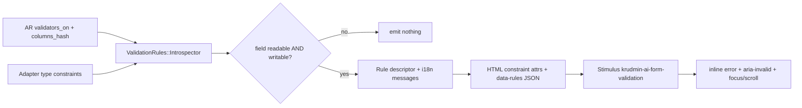

# Client-Side Form Validation — Implementation Plan

Status: **proposed / not implemented**
Owner: KrudminAI maintainers
Scope: engine form rendering, field adapters, Stimulus layer, docs and evidence

This document is the reference plan for introducing client-side form validation to KrudminAI. It is a design record, not a description of shipped behavior. Nothing in this document is implemented yet; the capability registry must not claim it until the phases below land with evidence.

---

## 1. Problem statement

Today every form validation is produced by ActiveRecord and only evaluated after a full round trip.

- Forms are plain Rails `form_with` with adapter-rendered native controls — see [app/views/krudmin_ai/resources/_form.html.erb](../app/views/krudmin_ai/resources/_form.html.erb) and [app/views/krudmin_ai/ui/_field.html.erb](../app/views/krudmin_ai/ui/_field.html.erb).
- The only per-control metadata emitted is `Adapter#control_options` → `class`, `disabled`, `aria-invalid`, `aria-describedby`, in [lib/krudmin_ai/fields/adapter.rb](../lib/krudmin_ai/fields/adapter.rb).
- No ActiveRecord validation introspection exists anywhere in the engine. `validators_on` is never called.
- Errors surface only after `record.save` fails in the mutation pipeline, re-rendered as a 422 with a summary `<section role="alert">` and a `<p class="krudmin-ai-field-error">` per field.
- On a long or sectioned form the user must find the offending field themselves; nothing focuses or scrolls to it.

Desired outcome:

1. Catch the validation classes that can be safely evaluated in the browser before submission.
2. On a failed submit attempt, move the user to the first field needing attention — scroll it into view, focus the control, and show the error inline.
3. Change nothing about the authoritative server path, and degrade to exactly today's behavior when JavaScript is unavailable.

---

## 2. Strategy

Single source of truth on the server, projected to the client.

Introspect ActiveRecord validators, column metadata, and adapter type semantics into a **normalized rule descriptor**. Render that descriptor as native HTML constraint attributes plus a JSON payload. Consume it with one Stimulus controller. The mutation pipeline remains authoritative and unchanged; client validation is purely an acceleration layer.



### Invariants this feature must preserve

- Authorization denies by default; the rule projection uses the same `field_readable?` / `field_writable?` decisions as rendering.
- The server is authoritative. A client rule may never be broader than its server counterpart.
- JavaScript-off behavior is byte-identical to today.
- Tests, docs, and `docs/capability_registry.json` are updated with the capability change.

---

## 3. Phase 1 — Rule introspection layer (Ruby)

New `KrudminAI::Validations::Introspector` at `lib/krudmin_ai/validations/introspector.rb`, reached from the resource as `resource.validation_rules(attribute, record, context)`.

### Sources, merged in order (later wins; most restrictive is kept)

1. **Column metadata** — `null: false` → `required`; `limit` → `maxlength`; numeric precision/scale → `step`.
2. **ActiveRecord validators** — `model_class.validators_on(attribute)`:

   | Validator | Projected rule |
   | --- | --- |
   | `PresenceValidator` | `required: true` |
   | `LengthValidator` | `minimum`, `maximum`, `is` |
   | `NumericalityValidator` | `greater_than`, `greater_than_or_equal_to`, `less_than`, `less_than_or_equal_to`, `only_integer`, `odd`, `even` |
   | `FormatValidator` | `pattern` — only when the Regexp is JS-portable |
   | `InclusionValidator` / `ExclusionValidator` (literal array) | `one_of` / `none_of` |
   | `AcceptanceValidator` | `required` on booleans |
   | `ConfirmationValidator` | `confirms: :attribute` |

3. **Adapter type constraints** — a new `Adapter#validation_constraints` hook so `Number`, `Decimal`, `Currency`, `Percentage`, `Date`, `DateTime`, `Email`, `Json`, `Enum`, `BelongsTo`, and `HasManyIds` contribute what they already enforce in `parameter` / `validate_submission`. This keeps client rules aligned with existing server type checks by construction rather than by duplication.

### Explicitly excluded — server-only, never projected

- `UniquenessValidator` — database dependent, and an information-disclosure vector. See Phase 6.
- Custom validator classes, `validate :method`, and any validator carrying `:if`, `:unless`, or `:on` that cannot be resolved statically.
- Any validator on a field whose read or write decision is denied for the current `AccessContext`.
- `FormatValidator` regexes using Ruby-only constructs (`\A`, `\z`, named groups, lookbehind, POSIX classes). Translate `\A` / `\z` → `^` / `$`; **drop the rule entirely** if anything else is unsupported rather than emitting a subtly different pattern.

A dropped rule is not a defect. It means the server catches that case on submit, exactly as it does today.

### Messages

Do not hand-write English strings in JavaScript. Generate each message server-side via `record.errors.generate_message(attribute, :blank)` and siblings, so client text is identical to what the server would render and honors the host's locale and any `activerecord.errors` overrides.

---

## 4. Phase 2 — Markup contract

### Native constraint attributes

Emitted from an extended `Adapter#control_options`; gives free browser validation, correct mobile keyboards, and assistive-technology semantics:

```
required, aria-required, minlength, maxlength, min, max, step, pattern, inputmode
```

### JSON payload for everything HTML cannot express

Placed on the field wrapper:

```html
<div class="krudmin-ai-field"
     data-controller="krudmin-ai-field-validation"
     data-krudmin-ai-field-validation-rules-value='{"required":true,"maximum":80,"messages":{"blank":"Title can&#39;t be blank"}}'>
```

### Structural changes to `app/views/krudmin_ai/ui/_field.html.erb`

- A **stable error container per field**, always present:
  `<p id="<field>-error" class="krudmin-ai-field-error" role="alert" hidden>`.
  Server-rendered errors and client-generated errors write into the same node, so there is exactly one error presentation to style and test.
- `aria-describedby` must **merge** the access-note id and the error id. Today it is either/or.
- The validation summary in `_form.html.erb` becomes a persistent, initially hidden live region the client can populate, with each item anchored to the corresponding control.

### Native validation fallback

Leave `novalidate` off the form in the rendered HTML. The controller sets `form.noValidate = true` in `connect()` so browsers do not fight the custom UI. If the controller never connects, native browser validation still applies.

---

## 5. Phase 3 — Client engine

Two files, deliberately split so the logic is unit-testable under `node --test` without a DOM:

- `app/javascript/krudmin_ai/validation/rules.js` — pure functions, `validateValue(rules, value) → [{ key, message }]`. No DOM, no Stimulus.
- `app/javascript/krudmin_ai/controllers/form_validation_controller.js` — registered as `krudmin-ai-form-validation` on the `<form>`; handles DOM wiring, focus, and the summary. Registered in [app/javascript/krudmin_ai/index.js](../app/javascript/krudmin_ai/index.js).

### Interaction model

| Trigger | Action |
| --- | --- |
| `blur` / `change` on a control | Validate that field; mark it touched |
| `input` | Re-validate **only if already touched and invalid**, so the form does not complain while the user is still typing |
| `submit` | Validate all visible, enabled, writable fields; if invalid, `preventDefault()`, populate the summary, then focus and scroll to the first invalid field |
| Server 422 re-render | Controller reconnects, reads the server-rendered errors, and marks those fields touched |

### Focus and scroll

```js
const control = firstInvalid.control
control.scrollIntoView({
  behavior: window.matchMedia("(prefers-reduced-motion: reduce)").matches ? "auto" : "smooth",
  block: "center"
})
control.focus({ preventScroll: true })
```

Alongside: set `aria-invalid="true"`, unhide `#<field>-error`, add `is-invalid` to `.krudmin-ai-field`, and define a `scroll-margin-top` token so sticky headers do not cover the focused field. Never focus on page load — only after an explicit submit attempt.

### Edge cases that must be designed for

- **Disabled or write-denied fields** — skipped entirely. A write-denied field must never block submission.
- **Collapsed sections** — if the first invalid field sits inside a hidden `<fieldset>` or a closed disclosure, expand it before focusing.
- **Nested rows** — rows marked `_destroy` are excluded. Rows added from the template by [nested_fields_controller.js](../app/javascript/krudmin_ai/controllers/nested_fields_controller.js) must pick up rules; emit a `krudmin-ai:nested-row-added` event from the nested controller and bind the new subtree, which is cleaner and cheaper than a `MutationObserver`.
- **RemoteBelongsTo** — validate the hidden value input, not the visible combobox, and clear errors from the existing selection flow.
- **Turbo** — perform all teardown in `disconnect()`; never let transient error state enter a Turbo snapshot.
- **Inline editing** in the list table — same controller, scoped to the row form.
- **Filter panel** — explicitly out of scope. Filter inputs are never required.

---

## 6. Phase 4 — Server/client parity guard

The long-term risk is drift: a validator added to a model that the projector mishandles, or a client rule that rejects input the server would accept, blocking a legitimate save.

Mitigations:

- Client rules are advisory and strictly narrower than server rules. When in doubt, drop the rule.
- The server response is always authoritative. If a submit passes client validation but returns 422, server errors overwrite client state.
- A spec iterates every validator class Rails ships and asserts the introspector either maps it or classifies it `server_only`, so a new Rails validator surfaces as a failing test rather than a silent gap.

---

## 7. Phase 5 — Optional, deferred: async uniqueness

Uniqueness is the most requested client check and the most dangerous one. Recommendation: hold it out of the first release. If implemented later:

- Opt-in per field (for example `field :email, :email, remote_validation: true`), never automatic.
- The endpoint applies tenant scope, then policy scope, like every other query. It returns only a boolean and never record data.
- Debounced, rate-limited, and gated behind a field-read decision — otherwise it becomes a user-enumeration oracle.
- Never blocks submit on network failure; falls back to server validation.

---

## 8. Testing plan

| Layer | Location | Coverage |
| --- | --- | --- |
| Introspector | `spec/lib/krudmin_ai/validations/introspector_spec.rb` | Each validator type maps to the expected rule; conditional, custom, and uniqueness validators classify as `server_only`; unsupported regexes are dropped; denied fields emit nothing |
| Adapter constraints | `spec/lib/krudmin_ai/fields/registry_spec.rb` | Per-type constraints for Number, Date, Enum, BelongsTo; Password and Hidden emit nothing |
| Rendering | request spec | Native attributes present; `aria-describedby` merges both ids; error node exists and is hidden |
| JS rules engine | `test/javascript/validation_rules.test.js` | Pure rule evaluation under `node --test`, no DOM |
| Browser | `demo/test/system/` | Submit with errors focuses and scrolls to the first invalid field; error text matches server text; nested row validation; **JS-disabled path still produces today's 422 render** |

---

## 9. Documentation and governance deliverables

Each capability change ships with docs and registry updates:

- Promote this plan into `docs/client_side_validation.md` describing shipped behavior: rule projection table, supported and unsupported validators, markup contract, extension points.
- Update [docs/ui_foundations.md](ui_foundations.md) for the error markup and focus behavior.
- Update [docs/field_adapters.md](field_adapters.md) for the `validation_constraints` hook.
- Update [docs/mutation_pipeline.md](mutation_pipeline.md) to record that the server remains authoritative.
- Add a `capabilities` entry to [docs/capability_registry.json](capability_registry.json), for example `client_side_form_validation`, with guarantees:
  - rules derive from server validators and adapter semantics
  - projection respects field read and write authorization
  - the server remains authoritative and JavaScript-off behavior is unchanged

  and an `evidence_gap` recorded until independent browser proof lands.

---

## 10. Suggested sequencing

1. Introspector plus the `validation_constraints` adapter hook, with specs. No UI change yet.
2. Markup contract: native attributes, unified error node, `aria-describedby` merge.
3. Stimulus controller plus the pure rules module, including focus and scroll.
4. Nested rows, RemoteBelongsTo, inline editing.
5. Docs, capability registry, browser evidence.
6. Deferred: async uniqueness.
